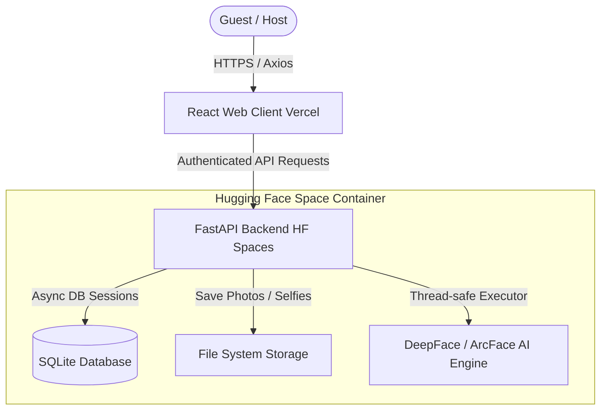

# Focal — AI-Powered Photo Distribution App

**Focal** is an AI-powered photo distribution application that automatically matches and distributes group event photos to the correct people using face recognition. After a group event (trip, wedding, college fest, hackathon), all photos end up on one device. Focal solves the manual sorting process automatically using face embeddings (ArcFace) and face detection (RetinaFace).

---

## 🏗️ Architecture

Focal is designed as a decoupled modern web application:
- **Frontend**: A React + Vite SPA built with custom premium dark vanilla CSS design tokens, hosted on **Vercel**.
- **Backend**: A FastAPI server running inside a Docker container on **Hugging Face Spaces**, storing data in a local SQLite database and a persistent file volume.



---

## 🚀 Quick Start Guide

### Step 1: Start the Backend locally

1. Navigate to the backend directory:
   ```bash
   cd backend
   ```
2. Create a virtual environment and activate it:
   ```bash
   python -m venv venv
   # On Windows:
   venv\Scripts\activate
   # On macOS/Linux:
   source venv/bin/activate
   ```
3. Install dependencies:
   ```bash
   pip install -r requirements.txt
   ```
4. Copy the environment template and configure:
   ```bash
   copy .env.example .env
   ```
5. Start the development server:
   ```bash
   python run.py
   ```
   The backend runs on **`http://localhost:7860`**. Visit interactive API docs at `http://localhost:7860/docs`.

---

### Step 2: Start the Web Client

1. Open a new terminal and navigate to the web directory:
   ```bash
   cd web
   ```
2. Install Node dependencies:
   ```bash
   npm install
   ```
3. Copy the environment template:
   ```bash
   copy .env.example .env
   ```
4. Launch the development server:
   ```bash
   npm run dev
   ```
   Open **`http://localhost:5173`** in your browser.

---

### Alternative: Local Docker Compose

You can boot the entire stack (backend + frontend) in a single command using Docker Compose:
```bash
docker-compose up --build
```
- Web Client: `http://localhost:5173`
- Backend API: `http://localhost:7860`

---

## ⚙️ Environment Variables

### Backend Configuration (`backend/.env`)

| Variable | Description | Default |
| :--- | :--- | :--- |
| `SECRET_KEY` | JWT signing secret key. Must be a secure random string in production. | *None (Fails fast in production)* |
| `DEBUG` | Enables development fallback secret keys and logs warning. | `false` |
| `PORT` | Port the FastAPI application listens on. | `7860` |
| `DATABASE_URL` | SQLite async connection URL. | `sqlite+aiosqlite:///./focal.db` |
| `CORS_ORIGINS` | Comma-separated list of allowed origins. | `*` |
| `RECOGNITION_MODEL` | Face recognition model for embeddings. | `ArcFace` |
| `DETECTOR_BACKEND` | Face detector model backend. | `retinaface` |
| `SIMILARITY_THRESHOLD` | Minimum cosine similarity score for face matches ($\ge 0.38$). | `0.38` |
| `FALLBACK_THRESHOLD` | Relaxed matching threshold fallback ($\ge 0.32$). | `0.32` |
| `INSURANCE_THRESHOLD` | Absolute minimum similarity score if no faces match ($\ge 0.28$). | `0.28` |
| `ENABLE_INSURANCE_MATCHING`| Enables distribution insurance to prevent unassigned photos. | `true` |
| `ALLOW_DESTRUCTIVE_MIGRATION`| Allows DB tables to reset on model change to prevent crashes. | `false` |

### Web Client Configuration (`web/.env`)

| Variable | Description | Example |
| :--- | :--- | :--- |
| `VITE_API_URL` | Base URL of the running FastAPI backend. | `https://techy-pranav-07-focal-backend.hf.space` |

---

## ☁️ Production Deployment

### 1. Backend — Hugging Face Spaces (Docker SDK)

1. Create a new **Hugging Face Space** at [huggingface.co/spaces](https://huggingface.co/new-space).
2. Choose **Docker** as the SDK and use the **Blank** template.
3. In your Space's Settings, add your environment secrets:
   - `SECRET_KEY`: A secure random password (e.g. `openssl rand -hex 32`).
   - `ALLOW_DESTRUCTIVE_MIGRATION`: `true` (on initial run to establish tables).
4. Clone the repository and push only the `backend` folder contents, OR push the repository contents directly to the Space's Git remote. Hugging Face will automatically build and start the Docker container on port `7860`.

### 2. Frontend — Vercel

1. Create a new project in **Vercel** pointing to your repository.
2. Configure build settings:
   - Framework Preset: **Vite**
   - Root Directory: `web`
3. Add Environment Variable:
   - `VITE_API_URL`: Point to your Hugging Face Space App URL (e.g. `https://your-username-your-space.hf.space`).
4. Click **Deploy**. Vercel will build the SPA and handle client routing redirects using `vercel.json` automatically.

---

## 🔒 Security & Reliability Enhancements

Focal has been hardened for production readiness:
- **Fail-Fast Safety**: Prevents backend boot if `SECRET_KEY` is missing in production.
- **Auth-Gated Media**: Uploaded event photos and user selfies are completely protected behind JWT checks. Direct file access is rejected, preventing leaking of photos.
- **Asynchronous AI Executions**: Wraps heavy DeepFace representations in a thread pool executor to prevent freezing the FastAPI event loop.
- **Batch Queries**: Solves N+1 SQL bottlenecks up front. Completed photos, matches, and face database listings are queried in single batch queries.
